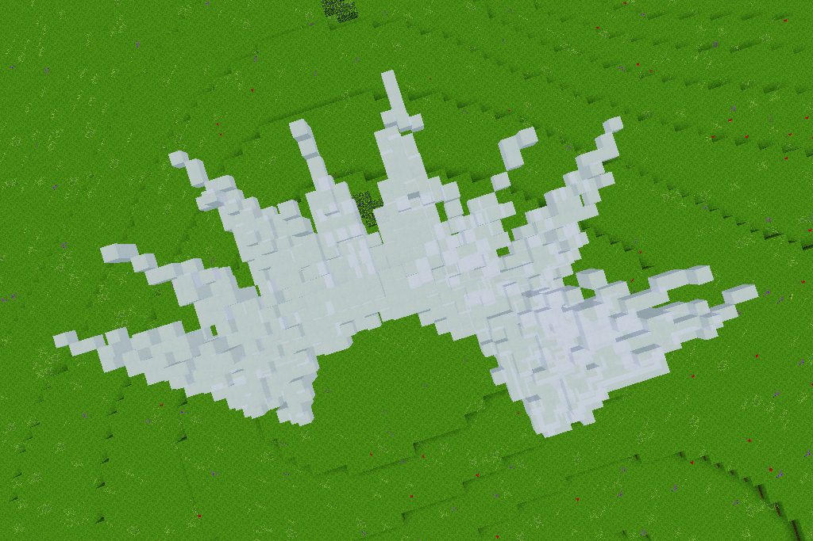

# Iceblast

Created as an exercise in VoxelManip and primitive forms for a Discord challenge.  

Craft the ice staff using ice, a mese fragment, and a stick (top to bottom, 1x3 shape).  

All code and media is licensed under the MIT license.  

`iceblast_blast.ogg` was created using multiple sounds from https://freesound.org and https://zapsplat.com.  
